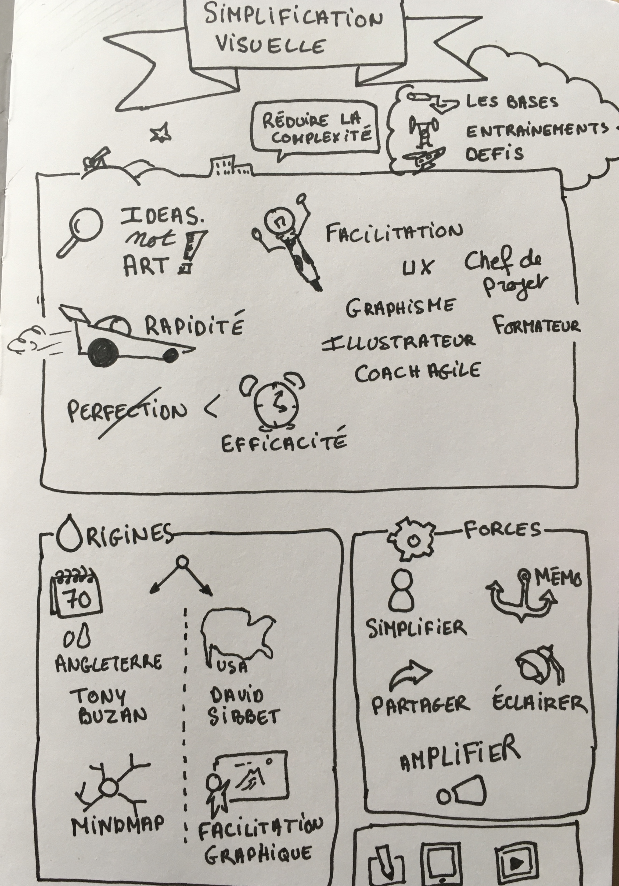
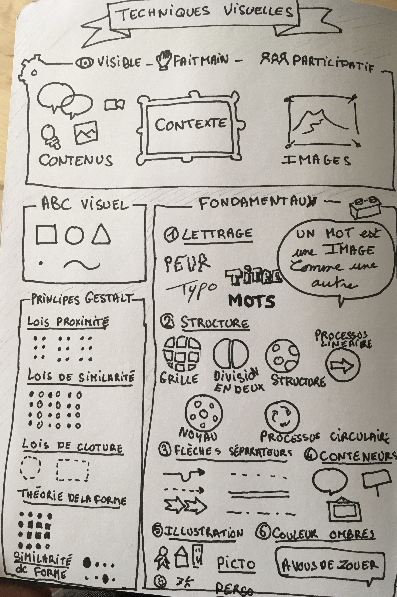
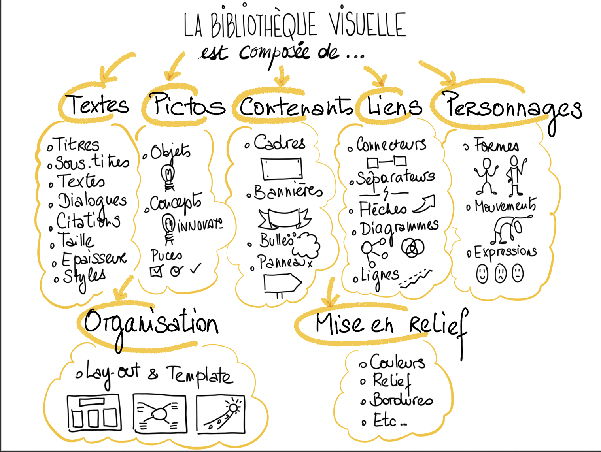
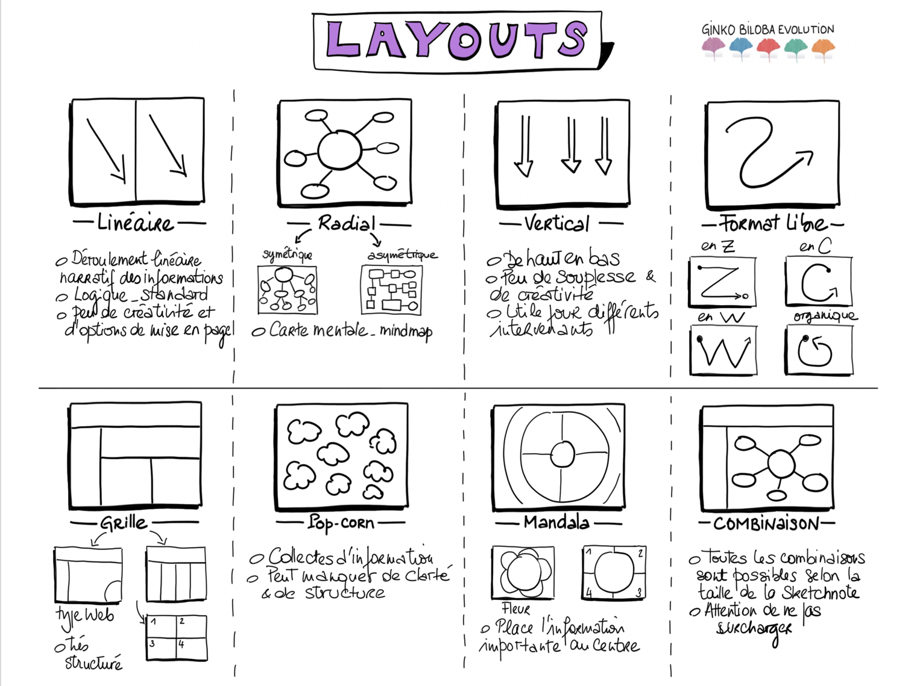
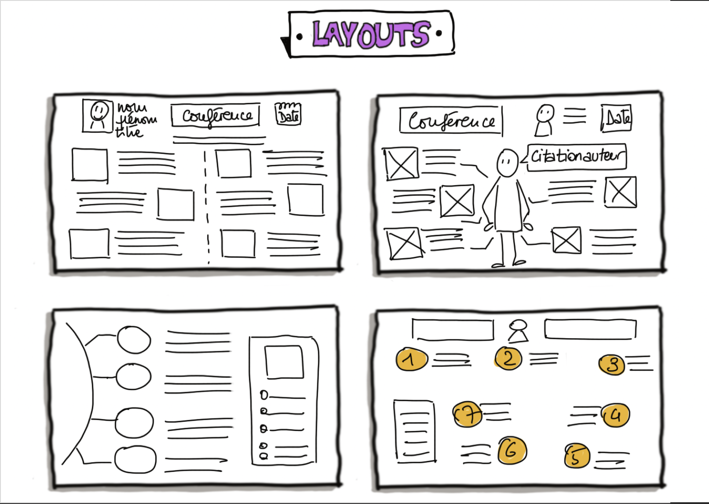
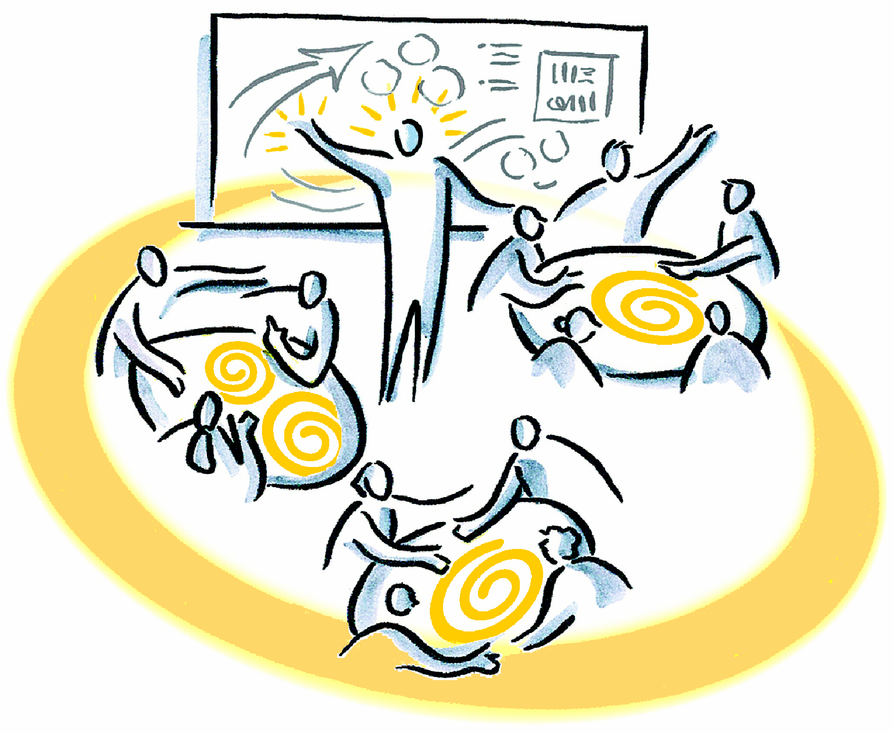

# UX Design & Design Thinking

## Règles de cours et ressources de bases

#### Niveau initiation
1. Connaissances théoriques Design thinking, UX
2. Mise en Pratique par des uses case
3. Test écrit

#### Niveau confirmé (niveau attendu pour la majorité)
1. Mise en Pratique, création d'une expérience utilisateur sur un projet DVIC (Phase d'inspiration, idéation, d'implémentation)
2. Test écrit
3. Mise en place d'un proof of concept, d'une phase de test

#### Niveau expert
1. Aide à la formation outils
2. Initiation à l'animation d'atelier
3. UX Research
4. Le passage de niveau confirmé à expert ouvre des ressources supplémentaires.

#### Outils
Initiation à la facilitation, facilitation graphique
- Icebreaker
- Mise en situation
- Différence entre facilitateur, chef de projet, coach
- Atelier
- Salle de Post IT numérique: Miro ou Klaxoon
- Prototypage d'interface: Adobe XD, Sketches, Figma...

Mise en Pratique, découverte d'atelier UX

#### Travail individuel voir 2 sites et des vidéos :
- https://uxdesignthinking.fr/index
- https://www.designkit.org/methods
- Youtube communauté Flupa UX Days
- UX Days 2019 by Flupa - Conférence : Charlotte Breton Schreiner https://www.youtube.com/watch?v=_-Crjwyc108
- UX Days 2019 by Flupa - Conférence : Alexia Buclet https://www.youtube.com/watch?v=ZDGAJtCqXGE
- UX Days 2019 by Flupa - Conférence : Laure Constantinesco et Chloé Girard Cas Leroy Merlin #design thinking https://www.youtube.com/watch?time_continue=661&v=O4FW9j0Zi4U
- UX Days 2019 by Flupa - Conférence : Yohan Founs Art Science https://www.youtube.com/watch?v=UWxYrN32F7k

## Design thinking et UX Design

[Voir le pdf](design_thinking_2020.pdf)

## UX Research resources

#### Design pour Handicap & inclusivity

* Amorce du design inclusif [anxiété] / Conférence de Charlotte Breton Schreiner
https://www.youtube.com/watch?v=_-Crjwyc108
* Inclusive Design
— https://www.microsoft.com/design/inclusive/
* Comment l’inclusivité améliore la vie pour tous
— https://www.oxo.com/aboutus

#### UX Research

* UX Design Thinking
— https://uxdesignthinking.fr/ [choisir Recherche sur filtres]

Ethics and values in UX Design
* The Values are the Experience, Kim Goodwin, UXLx - User Experience Lisbon
— https://www.youtube.com/watch?v=31Ae-7SC28E

#### Personas
* Getting from research to personas: harnessing the power of data, Kim Goodwin, Cooper, 2008
— archivé à : https://web.archive.org/web/20140214053446/https://www.cooper.com/journal/2008/05/getting_from_research_to_perso/

## Ressources en +
[Aramis ou l'amour des technique](https://www.amazon.fr/dp/2707121207/ref=cm_sw_r_pi_dp_x_rGj3zbBKVXQ1B) Bruno Latour (enquête sociologique d'une innovation qui n'a pas trouvé son marché)

[/content/enforced/43173-MIRMIR470120/RES_208_0009.pdf](https://devinci-online.brightspace.com/content/enforced/43173-MIRMIR470120/RES_208_0009.pdf?_&d2lSessionVal=zKSrBlQxVWnqC8WfUX8RAkIiy&_&d2lSessionVal=4lNxwNiJpAv11MF4pYVTidHZl) Dominique Pasquier

[Méthodes de design UX: 30 méthodes fondamentales pour concevoir des expériences optimales](https://www.amazon.fr/M%C3%A9thodes-design-fondamentales-concevoir-interactifs/dp/2212673981/ref=sr_1_1?__mk_fr_FR=%C3%85M%C3%85%C5%BD%C3%95%C3%91&dchild=1&keywords=methode+de+design+ux&qid=1602063906&quartzVehicle=842-1783&replacementKeywords=methode+de+design&sr=8-1)

[Stratégies de design UX: Accélérer l'innovation et réduire l'incertitude](https://www.amazon.fr/Strat%C3%A9gies-design-Acc%C3%A9l%C3%A9rer-linnovation-lincertitude-ebook/dp/B077YW2QW4/ref=sr_1_1?__mk_fr_FR=%C3%85M%C3%85%C5%BD%C3%95%C3%91&dchild=1&keywords=Strat%C3%A9gies+de+design+UX%3A+Acc%C3%A9l%C3%A9rer+l%27innovation+et+r%C3%A9duire+l%27incertitude&qid=1602064063&sr=8-1) (indispensable avec des liens vers de la biblio)

[Le design thinking par la pratique](https://www.amazon.fr/design-thinking-par-pratique-commercialisation/dp/2212143850/ref=sr_1_1?__mk_fr_FR=%C3%85M%C3%85%C5%BD%C3%95%C3%91&dchild=1&keywords=Le+design+thinking+par+la+pratique&qid=1602064028&sr=8-1): De la rencontre avec l'utilisateur à la commercialisation d'un produit innovant pour les seniors (pour aller + loin. Ce n'est pas un exemple numérique mais la méthode est la même. Très bien illustré) Le design thinking est une méthode très adapté à la méthode UX.

[La Gamification](https://livre.fnac.com/a7063093/Clement-Muletier-La-Gamification#omnsearchpos=1) Ou l'art d'utiliser les mécaniques du jeu dans votre business  (pour aller + loin)

https://issuu.com/jean-patrickpeche/docs/enseigner_et_pratiquer_le_design_th/45 (ressource d'un cours de design thinking)

sites:

www.designkit.org (design thinking - collection de méthode)

https://www.designersinteractifs.org/ (s’abonner à la newletters)

https://agiliste.fr/guide-de-demarrage-scrum/ (Méthode agile)

https://www.youtube.com/channel/UCFsEoAvJLPyH_j3isgParZw (Chaine youtube autour de UX - Incontournable)

## Simplification visuelle
Biblio

UZMO Pensez avec son stylo. Présenter ses idées, convaincre et faciliter avec la pensée visuelle ! De Martin Haussmann

Bibliographie Initiation au sketchnote de Mike Rohde - Le guide illustré de la prise de notes visuelles Pensée de images de Vanina Gallo Apprendre avec le sketchnoting

Comment re enchanter les manières d apprendre grâce a la pensée visuelle de AKOUN/BOUKOBZA/PAILLEAU

Travailler avec le sketchnoting Comment gagner en efficacité et en sérénité grâce a la pensée visuelle de PAILLEAU ISABELLE

Guide de survie aux réunions. Sacha Lopez, David Lemesle, Marc Bourguignon.

Wébinar autour de la métaphore du corps https://www.youtube.com/watch?v=5NMfG-U80Dk

#### Exercices autour des formes simples

## Facilitation

Facilitation provient du verbe faciliter, qui lui-même provient de l’italien facilitare : rendre facile ou plus facile. La racine latine commune étant l’adjectif facilitis : qui se fait aisément.

Le mot facilitation est défini ainsi par le lexique du logiciel Antidote, dont la définition est bien plus fournie que celle du Larousse :

(didactique) Action de faciliter
(technique) Ensemble des mesures visant à accélérer le transport de marchandises, par air et par mer
(physiologique) Augmentation de l’excitabilité suite à un stimulus, unique ou répété.
Stendhal aurait été un des premiers auteurs à utiliser ce terme dans son ouvrage « Souvenirs d’égotisme » (1832, p.99) : « Mme Pasta restait longtemps, par exemple deux secondes ou trois, dans la même position. Cela a-t-il été une facilitation ou un obstacle de plus à vaincre ? »

Si le terme « facilitation » est donc communément utilisé pour décrire l’action de rendre facile ou plus facile, nous pouvons aisément conclure à ce stade, que nous faisons tous de la facilitation tous les jours. Qui ne cherche pas instinctivement à se simplifier la vie ou à rendre plus facile la tâche ou la réflexion d’autrui ?

La définition de la facilitation comme champ d’activité professionnelle, que nous pouvons aussi appeler plus précisément la facilitation de développement organisationnel, pose cependant quelques difficultés. Il semblerait qu’aucune version officielle n’ait encore totalement retenu l’adhésion de toute la communauté des facilitateurs et encore moins celle des lexicographes.

L’IAF ([Association Internationale des Facilitateurs](http://www.formapart.fr/le-blog-de-la-facilitation/iaf-association-internationale-des-facilitateurs/)) reprend la définition de Roger Schwarz que j’ai traduite ainsi : « la facilitation de groupe est un process dont le choix est acceptable pour tous les membres du groupe, suffisamment neutre et qui n’a aucune autorité décisionnelle, diagnostique et intervient pour aider un groupe pour identifier, résoudre les problèmes, prendre des décisions et pour augmenter l’efficacité du groupe. »Ouf !! Si vous avez une meilleure traduction, je vous écoute, admiratif. Version originale ci-dessous[[1](https://formapart.fr/blog/2012/04/05/definition-de-la-facilitation/#1)]: bon courage !

la suite sur [Formapart](https://formapart.fr/blog/2012/04/05/definition-de-la-facilitation/)
